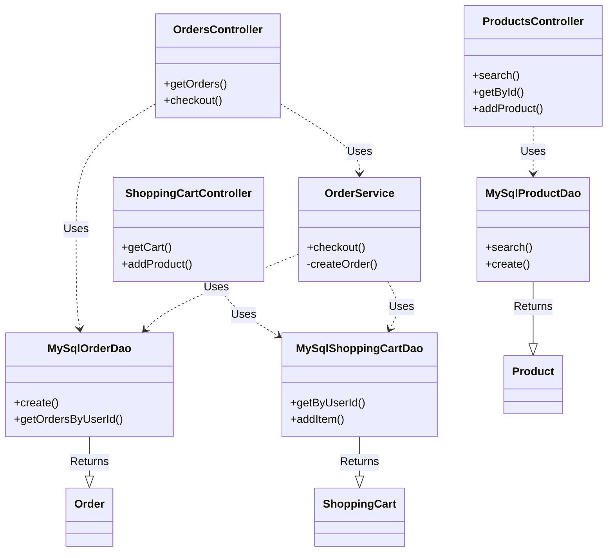

---

# EasyShop Application Backend API

## Project Overview

The **EasyShop Application** is a robust e-commerce backend built with Java and Spring Boot. It serves as a RESTful API that handles the core functionalities of an online store, including user authentication, product catalog management, shopping cart persistence, and order processing.

The architecture follows a standard layered approach (Controller-Service-DAO), utilizing JDBC for direct database interactions to ensure optimized performance and granular control over SQL queries. The application is designed to support different user roles (Guests, Users, and Administrators) with specific access controls.

## Table of Contents

1. [Tech Stack](#tech-stack)
2. [Features](#features)
3. [Project Tree](#project-tree)
4. [Database Design](#database-design)
5. [Class Interaction Diagram](#class-interaction-diagram)
6. [API Endpoints](#api-endpoints)
7. [Product Search](#product-search)
9. [Authentication & Authorization](#authentication--authorization)
11. [Code Highlight: Order Retrieval](#code-highlight-order-retrieval)
12. [Error Handling](#error-handling)

---

## Tech Stack

* **Language:** Java 17
* **Framework:** Spring Boot 2.7.3
* **Build Tool:** Maven
* **Database:** MySQL 8.0
* **Persistence:** JDBC (Java Database Connectivity)
* **Security:** Spring Security, JWT (JSON Web Tokens), BCrypt Password Hashing
* **Testing:** JUnit 5, Spring Boot Test

---

## Features

* **Product Management:** Users can browse products and categories. Administrators can create, update, and delete inventory.
* **Advanced Search:** Filter products by price range, category, and specific attributes.
* **User Accounts:** Secure registration and login functionality.
* **Profile Management:** Users can manage their personal shipping information.
* **Shopping Cart:** A persistent shopping cart that stores items in the database per user session.
* **Checkout System:** Converts shopping cart items into a permanent order record.
* **Role-Based Access Control:**
* `Public`: View products and categories.
* `ROLE_USER`: Manage cart, checkout, view profile/orders.
* `ROLE_ADMIN`: Full CRUD access to products and categories.

---

## Project Tree

Below is an overview of the main source directory structure:

```text
src/main/java/org/yearup
├── EasyShopApplicationBackend.java  # Main Entry Point
├── configurations
│   └── DatabaseConfig.java          # DataSource configuration
├── controllers                      # REST Controllers (API Layer)
│   ├── AuthenticationController.java
│   ├── CategoriesController.java
│   ├── OrdersController.java
│   ├── ProductsController.java
│   ├── ProfileController.java
│   └── ShoppingCartController.java
├── data                             # DAO Interfaces
│   ├── mysql                        # MySQL JDBC Implementations
│   │   ├── MySqlCategoryDao.java
│   │   ├── MySqlDaoBase.java
│   │   ├── MySqlOrderDao.java
│   │   ├── MySqlProductDao.java
│   │   └── ...
│   └── ...
├── models                           # POJOs (Entities)
│   ├── authentication               # DTOs for Auth
│   ├── Category.java
│   ├── Order.java
│   ├── Product.java
│   ├── ShoppingCart.java
│   └── User.java
├── security                         # JWT Security Config
│   ├── WebSecurityConfig.java
│   ├── jwt
│   └── ...
└── services                         # Business Logic Layer
    └── OrderService.java

```

---

## Database Design

The application is backed by a relational MySQL database containing the following primary tables:

* **`users`**: Stores authentication credentials (hashed passwords) and roles.
* **`profiles`**: Stores user demographic data (Address, City, State). One-to-one relationship with `users`.
* **`categories`**: Groupings for products.
* **`products`**: Inventory items linked to categories.
* **`shopping_cart`**: Stores temporary items selected by a user.
* **`orders`**: Permanent records of completed transactions.
* **`order_line_items`**: The specific products and quantities within an order.

---

## Class Interaction Diagram

The following diagram illustrates the relationship between the Controllers, the Service layer (where applicable), the Data Access Objects (DAOs), and the database models.



---

## API Endpoints

### Authentication

* `POST /register`: Register a new user account.
* `POST /login`: Authenticate and receive a JWT Bearer token.

### Products & Categories

* `GET /products`: Get all products (with optional search params).
* `GET /products/{id}`: Get a specific product.
* `POST /products`: Add a product (Admin only).
* `PUT /products/{id}`: Update a product (Admin only).
* `DELETE /products/{id}`: Remove a product (Admin only).
* `GET /categories`: List all categories.
* `GET /categories/{id}`: Get a specific category.

### Shopping Cart

* `GET /cart`: Retrieve the authenticated user's cart.
* `POST /cart/products/{productId}`: Add an item to the cart.
* `PUT /cart/products/{productId}`: Update item quantity.
* `DELETE /cart`: Clear the shopping cart.

### Orders

* `GET /orders/view`: View past orders for the logged-in user.
* `POST /orders`: Checkout current cart items to create a new order.

---

## Product Search

The application supports dynamic filtering via the `GET /products` endpoint. You can combine any of the following query parameters:

* **`cat`**: Filter by Category ID.
* **`minPrice`**: Filter products above a certain price.
* **`maxPrice`**: Filter products below a certain price.
* **`subCategory`**: Filter by specific sub-category string.

**Example Request:**

```http
GET /products?cat=1&minPrice=50.00&maxPrice=200.00

```

---

## Authentication & Authorization

Security is implemented using **JSON Web Tokens (JWT)**.

1. **Stateless:** The server does not hold session state.
2. **Filter Chain:** A `JWTFilter` intercepts requests to check for the `Authorization: Bearer <token>` header.
3. **Token Provider:** Validates the signature and extracts user authorities (Roles).
4. **Access Control:**
* Annotations like `@PreAuthorize("hasRole('ROLE_ADMIN')")` are used on Controller methods to enforce permissions.
* `UserNotActivatedException` handles cases where a user account is inactive.

---

## Code Highlight: Order Retrieval

The `OrdersController` allows users to view their own order history. This endpoint demonstrates how we extract the authenticated user's identity from the security context to ensure users can only access their own data. In this snippet, the `Principal` object is injected by Spring Security. This object contains the username of the person who sent the JWT token. We use `userDao` to look up the full user record (to get the numerical `userId`), and then pass that ID to `orderDao` to fetch the SQL records. This ensures secure data isolation between users.

```java
    /**
     * Retrieves all orders associated with the currently authenticated user.
     * This method uses the authenticated user’s security principal to identify the user
     * making the request and returns a list of orders that belong only to that user.
     */
    @GetMapping("view")
    @PreAuthorize("isAuthenticated()") // check to ensure correct user is accessing method
    public List<Order> getOrders(Principal principal) {

        // try to execute code to retrieve orders
        try {
            // first get the user by accessing principal and getting the name attribute
            User user = userDao.getUserByUserName(principal.getName());
            
            // if no user is found, throw NOT_FOUND error
            if (user == null) throw new ResponseStatusException(HttpStatus.NOT_FOUND);
            
            // otherwise, retrieve userId
            int userId = user.getId();
            
            // use userId to call orderDao and return list of orders
            return orderDao.getOrdersByUserId(userId);

        } catch (Exception ex) { // throw internal server error if dao fails
            throw new ResponseStatusException(HttpStatus.INTERNAL_SERVER_ERROR, "Oops... our bad.");
        }
    }

```

---

## Error Handling

The API uses standard HTTP Status codes to communicate outcomes:

* **200 OK**: Successful retrieval.
* **201 Created**: Successful resource creation.
* **204 No Content**: Successful deletion.
* **401 Unauthorized**: Missing or invalid JWT token.
* **403 Forbidden**: Valid token, but insufficient permissions (e.g., User trying to delete a product).
* **404 Not Found**: Resource (Product, User, etc.) does not exist.
* **500 Internal Server Error**: Database failures or unexpected exceptions.

Exceptions are handled via `ResponseStatusException` within the controllers to ensure clean JSON error responses.

---
